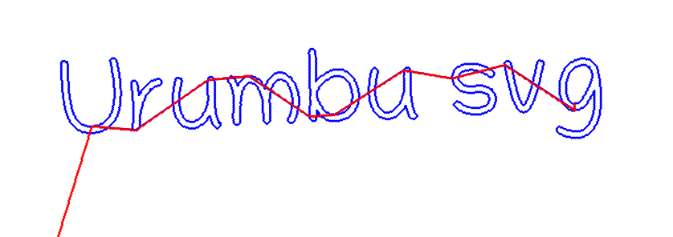
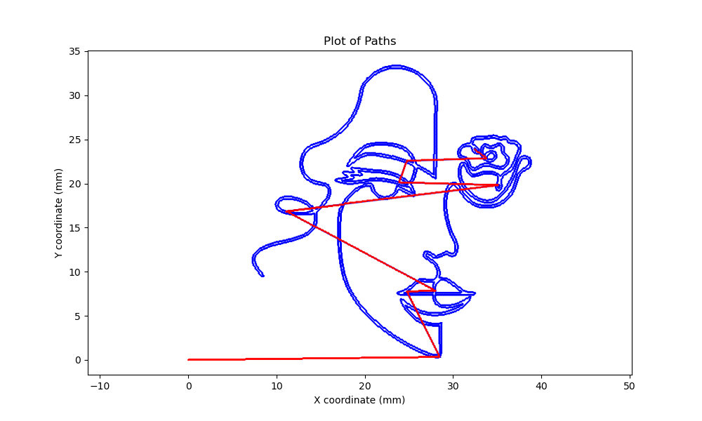

# Urumbu SVG

## Overview
The urumbu_svg script is a modified version of Quentin Bolsee's urumbu_gcode.py, further modified by Robert Hart between January 13-14, 2022. It is designed to operate the Urumbu machine, a custom plotting device with X, Y, and a servo-driven Z-axis, translating SVG and XY file formats directly into movement commands. This Python script uses [axidraw](https://github.com/evil-mad/axidraw) parsing functionalities to convert a SVG to a set of polylines. It then convert those polylines to stepper control.


## Features
- Serial Communication: Establishes connection with hardware via serial ports.
- Vector to Motor Translation: Translates SVG and XY vector file formats into stepper and servo motor commands.
- Preview Mode: Offers a preview mode to visualize paths without hardware.
- Flexible Configuration: Supports configurable parameters for motor steps per unit, feed rates, and servo pulse widths.


## Installation
Clone the Repository: Clone or download this repository to your local machine.

Dependencies: Ensure you have Python>=3.7 installed along with the following packages:

- numpy
- matplotlib
- pyserial
- argparse
- logging
- multiprocessing

Install the necessary Python packages using:

```bash
pip install numpy matplotlib pyserial argparse pyaxidraw
```
Install pyaxidraw using : 
```bash
python -m pip install https://cdn.evilmadscientist.com/dl/ad/public/AxiDraw_API.zip
```

Serial Port Permissions: Make sure your user has the necessary permissions to access the serial ports on your system.

## Usage
Command Line Interface
The script is run from the command line with a variety of arguments to specify the file to plot and the configuration of the plotter.

```bash
python urumbu_svg.py -f <filename> [options]
```
Arguments:

- -f, --filename: Specifies the filename of the .xy or .svg file to plot.
- --feedrate: Sets the feedrate for XY motion (default: 5).
- -a: COM port for the first stepper motor.
- -b: COM port for the second stepper motor.
- -s: COM port for the servo motor.
- --max-width: Maximum width of the plot in mm (default: 50).
- --max-height: Maximum height of the plot in mm (default: 50).
- --preview: Runs the script in preview mode without controlling any hardware.


## File Formats
The script accepts two file formats:

.svg: Scalable Vector Graphics file.
.xy: A custom format where each line contains commands or coordinates for plotting.

### Example

For preview mode : 

```bash
python urumbu_svg.py -f examples/portrait.svg --preview True --feedrate 50
```





## Acknowledgements
Original concept and code by Quentin Bolsee.
Modifications and enhancements by Robert Hart.